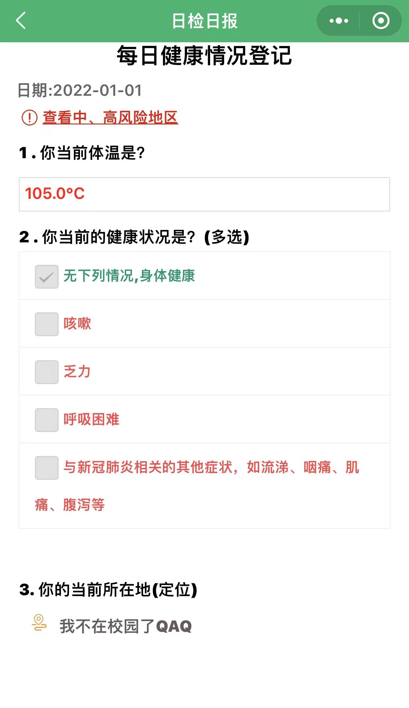

# 我在校园Quantumult X脚本
>理论上支持Quantumult X, Surge, Loon. 仅在Quantumult X上测试。

* [我在校园日检日报  heat.js](#我在校园日检日报----heatjs)
* [模拟假条"列表"  getList.js](#模拟假条列表----getlistjs)
* [模拟假条  getLeave.js](#模拟假条----getleavejs)

# 免责声明

- **务必遵守疫情防控、法律法规、校规！**
- **仅供交流学习，一切责任由使用者自负，与作者无关。**

# 我在校园日检日报    [./heat.js](./heat.js)

## 这回真不在校园了

</img>

## 说明

- **务必遵守疫情防控、法律法规、校规！**
  
- **仅供交流学习，一切责任由使用者自负，与作者无关。**

- 理论上支持Quantumult X, Surge, Loon. 仅在Quantumult X上测试。

- 使用了持久化储存，可以通过网络订阅脚本使用。
  
- 可选择手动配置`JWSESSION`或者通过rewrite自动获取`JWSESSION`。

- 手动设置打卡需要的数据，脚本运行成功后会保存。

- 如需更新打卡数据，配置`clear_data`改为`true`

- 手动设置`JWSESSION`时，如需更新`JWSESSION`，将`clear_token`改为`true`。（通过rewrite自动获取`JWSESSION`无需此操作）

- 学校不再使用我在校园，本脚本不会再更新了。

## Quantumult X配置
```
#rewrite_local规则，访问“我的课程”时自动获取JWSESSION
[rewrite_local]
^https://student.wozaixiaoyuan.com/course/getCourseList.json url script-request-header heat.js

[mitm]
hostname = student.wozaixiaoyuan.com

#task_local规则，每天定时自动执行脚本
[task_local]
5 0,11,15 * * * heat.js, tag=日检日报, enabled=true
```

## 需要修改的数据

```JavaScript
const answers = '["0"]';		//选择题选项
const temperature = '36.666';	//体温（摄氏）
const latitude = '23.666';		//纬度
const longitude = '112.666';	//经度
const country = '中国';			//国家
const city = '佛山市';			//城市
const district = '三水区';		//区
const province = '广东省';		//省
const township = '云东海街道';	//镇、街道
const street = '学海中路';		//街、路
```
## Todo

学校不再使用我在校园，本脚本不会再更新了

 - [ ] ~~实现自动抓取打卡数据~~
 - [ ] ~~实现自动抓取打卡时间段~~
 - [ ] ~~判断重复签到~~


# 模拟假条"列表"    [./getList.js](./getList.js)

1. **务必遵守疫情防控、法律法规、校规！**
2. 至少正常请假一次，本脚本才能运行。
3. 脚本只是修改了本地数据，没有对服务器上的数据进行操作。
4. **仅供交流学习，一切责任由使用者自负，与作者无关。**

## Quantumult X配置
[rewrite]
```
 类型: script-response-body

 url: ^https://student\.wozaixiaoyuan\.com/leave2/getList\.json
```

[Mitm]
```
主机名: student.wozaixiaoyuan.com
```


# 模拟假条    [./getLeave.js](./getLeave.js)

1. **务必遵守疫情防控、法律法规、校规！**
2. 至少正常请假一次，本脚本才能运行。
3. 脚本只是修改了本地数据，没有对服务器上的数据进行操作。
4. **仅供交流学习，一切责任由使用者自负，与作者无关。**

## Quantumult X配置
[rewrite]
```
 类型: script-response-body

 url: ^https://student\.wozaixiaoyuan\.com/leave2/getLeave\.json
```

[Mitm]
```
主机名: student.wozaixiaoyuan.com
```

# 参考、致谢

基于[Milky01/wozaixiaoyuan](https://github.com/Milky01/wozaixiaoyuan) 修改。

参考了[@NobyDa](https://github.com/NobyDa)和[@chavyleung](https://github.com/chavyleung)的环境封装函数。

感谢[@chiupam](https://github.com/chiupam)的提议和帮助


